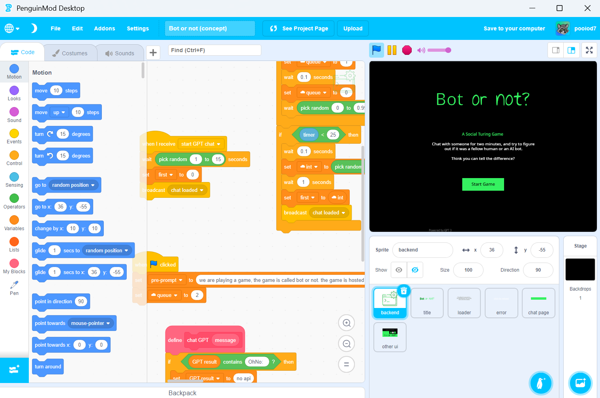

# Penguinmod Desktop (Unofficial)



**Penguinmod Desktop** is an unofficial wrapper for [PenguinMod](https://penguinmod.com), designed to run the site in a minimal desktop browser environment with persistent file caching.

> This project is a work in progress, expect it to crash a lot

## Features
- Works offline, even url based extension
- Cache whitelist editor (press ctrl + m)

## Platform Support
This project is developed for Windows. Compatibility on Linux or macOS is untested

## How It Works
Penguinmod Desktop embeds PenguinMod in a PyQt5-based web browser. Any resources loaded through the browser are cached if they are from a whitelisted domain.

## How to use
Install the following
```bash
pip install PyQt5 PyQtWebEngine requests
```
Then use [auto-py-to-exe](https://pypi.org/project/auto-py-to-exe)

Compile settings:
```
Script Location:
srd/main.py

Onefile:
One Directory

Console Window:
Window Based

Icon:
src/icon.ico

Aditional Files:
src/domains.json
src/icon.ico
install.py
manager.py
src/script.js

Aditional Folders:
src/offline_data/offline_data

--name: PenguinMod Desktop
```

<sub>- This project is not affiliated with PenguinMod or Scratch</sub>
